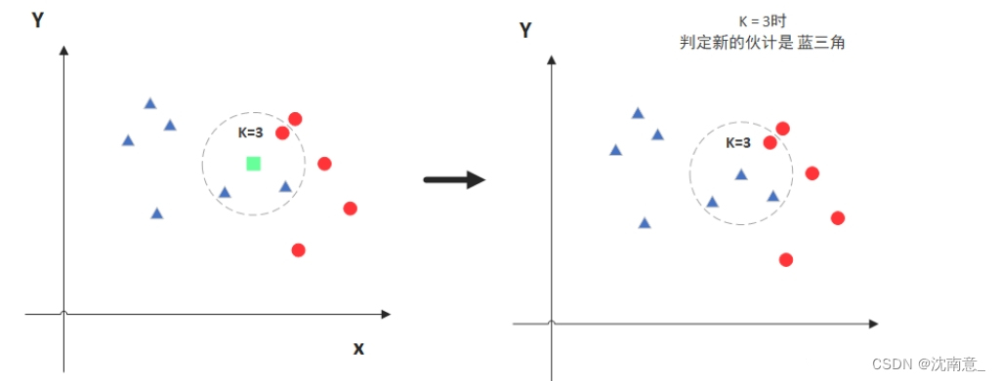
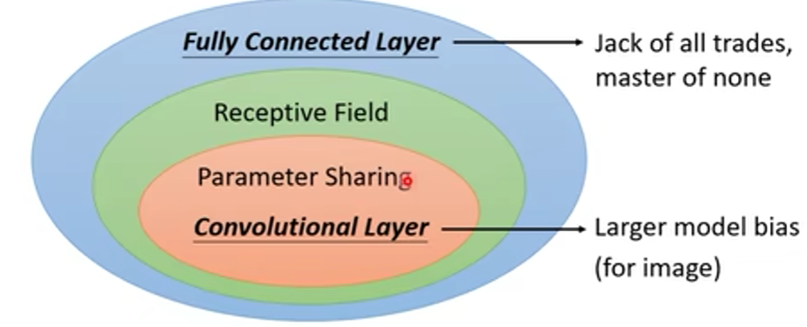

# 机器学习-基础

### 浅层机器学习（聚类算法）

- 监督学习、无监督学习
    1. 概念
        1. 在有监督学习中，模型通过学习带有标签的训练数据来建立预测函数。这意味着每个训练样本都有一个已知的输出或标签。
            - 算法包括：线性回归、逻辑回归、支持向量机（SVM）、决策树、随机森林和神经网络等。
        2. 在无监督学习中，模型通过学习没有标签的训练数据来发现数据中的模式和结构。这意味着训练样本没有已知的输出或标签。
            - **例子**：算法包括：聚类算法（如 K-means 和层次聚类）、降维算法（如主成分分析 PCA 和 t-SNE）和关联规则学习（如 Apriori 算法）等。
    2. 指标
        1. 无监督聚类指标
           
            > TP（True Positive）表示将正类预测为正类数的样本个数，TN （True Negative）表示将负类预测为负类数的样本个数，
            > 
            
            > FP（False Positive）表示将负类预测为正类数误报的样本个数，FN（False Negative）表示将正类预测为负类数的样本个数。
            > 
            
            > $Precision=\frac{TP}{TP+FP}$ ， $Recall=\frac{TP}{TP+FN}$
            > 
            - **F值（F-measure，FM）**：$F-measure=\frac{2Recall\times Precision}{Recall+Precision}$
            - **准确率（Accuracy，ACC）**：$ACC=\frac{TP+TN}{TP+TN+FP+FN}$
                - 直接匹配标签（适用于监督学习）
                - 会受到族类标签排列的影响
            - **标准互信息（Normalized Mutual Information，NMI）**：$NMI=\frac{I\left(U,V\right)}{\sqrt{H\left(U\right)H\left(V\right)}}$
                - 考虑了聚类结果和真实标签之间的信息共享程度
                - 在使用NMI时需要确保两个聚类结果具有相同的大小。
            - **兰德指数（Rand Index，RI）**，其值域为[0,1]：$RI=\frac{a+b}{C_2^{n_{samples}}}$
                - 给定实际类别信息 C，假设 K 是聚类结果，a表示在 C与 K中都是同类别的元素对数，b 表示在 C与 K中都不是同类别元素的个数
                
    
- KNN / 最临近算法**（监督学习）**
    - 参考：
        - [KNN算法（k近邻算法）原理及总结-CSDN博客](https://blog.csdn.net/m0_74405427/article/details/133714384)
    1. **原理：**
        - 当预测一个新样本的类别时，**根据它距离最近的 K 个样本点是什么类别来判断该新样本属于哪个类别**（多数投票）
          
            
            
        
    2. **算法流程**
        1. **选择参数K**：确定最近邻的数量K。
        2. **计算距离**：对于给定的测试样本，计算它与所有训练样本之间的距离。常用的距离度量方法包括欧氏距离、曼哈顿距离等。
        3. **查找最近的K个邻居**：根据计算出的距离，找到与测试样本距离最近的K个训练样本。
        4. **分类决策**：根据这K个邻居的类别进行投票，将测试样本归类到票数最多的类别中。
        
    3. **参数选择**
        - 最近邻的数量（K值）：
          
            通过交叉验证（将样本数据按照一定比例，拆分出训练用的数据和验证用的数据，比如6：4拆分出部分训练数据和验证数据），从选取一个较小的K值开始，不断增加K的值，然后计算验证集合的方差，最终找到一个比较合适的K值。
            
            
            
        - 点距离的计算：
          
            
            
        
        [KNN代码实现](https://www.notion.so/KNN-15c34f9e37af808fb76ffb14a395bd81?pvs=21)
        
    
- NBC / 朴素贝叶斯**（监督学习）**
    - 参考：
        - https://blog.csdn.net/zcz0101/article/details/109577494
    1. **原理：**
        - 利用贝叶斯公式根据某特征的先验概率计算出其后验概率，然后选择具有最大后验概率作为该特征所属的类。
          
            $$
            \mathcal{P}(\text{类别}|\text{特征})=\mathcal{P}(\text{类别})\mathcal{P}(\text{特征}|\text{类别})
            $$
            
        - 缺点：**所有的特征之间是相对独立的**
        
    2. **算法分类**
        1. 高斯朴素贝叶斯
           
            在处理连续数据的分类时，通常选用高斯朴素贝叶斯算法。Gaussian NB就是先验概率为高斯分布的朴素贝叶斯。假设每一个特征的数据都服从高斯分布。
            
            $$
            \mathrm{P\left(X_j=x_j|Y=C_k\right)=\frac{1}{\sqrt{2\pi\sigma^2}}e^{(-\frac{(x_j-\mu_k)^2}{2\sigma_k^2})}}
            $$
            
        2. 多项式朴素贝叶斯
           
            多项式朴素贝叶斯就是先验概率为多项式分布的朴素贝叶斯。
            
            假设特征是由一个简单多项式分布生成的。多项式分布可以描述各种类型样本出现次数的概率，因此非常适合用于**描述出现次数**或者**出现次数比例**的特征。该模型常用于文本分类，特征值表示的是次数。
            
            $$
            \mathrm{P}（\mathrm{X}_{\mathrm{j}}=\mathrm{x}_{\mathrm{jl}}\left|\mathrm{Y}=\mathrm{C}_{\mathrm{k}}\right)=\frac{\mathrm{x}_\mathrm{jl}+\lambda}{\mathrm{m}_\mathrm{k}+\mathrm{n}\lambda}
            $$
            
        3. 伯努利朴素贝叶斯
           
            伯努利朴素贝叶斯就是先验概率为伯努利分布的朴素贝叶斯。假设特征的先验概率为二元伯努利分布。
            
            $$
            \mathrm{P}\left(\mathrm{X}_\mathrm{j}=\mathrm{x}_\mathrm{jl}|\mathrm{Y}=\mathrm{C}_\mathrm{k}\right)=\frac{\mathrm{x}_\mathrm{jl}+\lambda}{\mathrm{m}_\mathrm{k}+2\lambda}
            $$
    
- **K-means（无监督学习）**
    - 参考：
        - https://zhuanlan.zhihu.com/p/184686598
        - https://github.com/helloWorldchn/MachineLearning/tree/main
    1. **原理：**
        - 基本思想是，通过迭代寻找K个簇（Cluster）的一种划分方案，使得**聚类结果对应的损失函数最小**。
        - https://www.naftaliharris.com/blog/visualizing-k-means-clustering/
        
    2. **算法流程**：
       
        $$
        J(c,\mu)=\sum_{i=1}^M\left|\left|x_i-\mu_{c_i}\right|\right|^2
        $$
        
        - 参数
            - 簇的数量K：决定了最终形成的簇的数量。通常，K的值需要事先指定，或者通过一些启发式方法来确定，如肘部法则。
        - 步骤
            - 初始化：随机选择K个对象作为初始的聚类中心。
            - 分配：计算每个对象与各个种子聚类中心之间的距离，把每个对象分配给距离它最近的聚类中心。
            - 更新：重新计算每个簇的质心，即该簇所有数据点的均值。
            - 迭代：重复分配和更新步骤，直到质心不再改变或达到迭代次数限制**15**
        
        [K-means代码实现](https://www.notion.so/K-means-15c34f9e37af809a8d3dec59fce7ea3e?pvs=21)
        
    3. **算法复杂度**
       
        O（NKt）=O（N）（N是数据量，K是聚类总数、t为迭代轮数），接近于线性
        
    4. **缺点**：
        1. 要求用户必须事先给出要生成的簇的数目K。
        2. 对初值敏感。
        3. 对于孤立点数据敏感。
           
        
    5. 算法优化
        1. 数据预处理（去除噪声点）
           
            KMeans本质上是一种基于**欧氏距离**的数据划分方法，均值和方差大的维度将对数据的聚类结果产生决定性影响。
            
        2. 合理选择K值
           
            采用**手肘法**，尝试不同K值并将对应的损失函数画成折线。手肘法认为图上的**拐点就是K的最佳值**（图中对应K=3）。
            
            
            
        
    6. K-means++
        1. 优化点：**初始的聚类中心之间的相互距离要尽可能的远**。
        2. 步骤：
            - 随机选取一个样本作为第一个聚类中心；
            - 计算每个样本与当前已有聚类中心的最短距离（即与最近一个聚类中心的距离），这个值越大，表示被选取作为聚类中心的概率较大。最后，用轮盘法（依据概率大小来进行抽选）选出下一个聚类中心；
            - 重复上述步骤，直到选出K个聚类中心。
            - 选出初始点后，就继续使用标准的K-means算法了。
    
- DBSCAN**（无监督学习）**
    - 参考：
        - https://github.com/helloWorldchn/MachineLearning/tree/main
    1. **原理：**
        - DBSCAN算法通过**检查数据集中的点的邻域**来形成簇。其核心思想是**密度可达性**，即如果一个点在某个密度阈值内有足够多的邻居，它就会与这些邻居形成一个簇。
        - https://www.naftaliharris.com/blog/visualizing-dbscan-clustering/
        
    2. **算法流程**：
       
        
        
        - 概念
            - 核心点：在半径Eps内含有不少于MinPts数目的点
            - 边界点：在半径Eps内点的数量小于MinPts，但是落在核心点的邻域内
            - 噪音点：既不是核心点也不是边界点的点
        - 参数
            - **eps**：定义了一个点的邻域的最大距离（即半径）。如果一个点的邻域内有至少 `min_samples` 个点，则这些点被认为是一个簇的一部分。
            - **min_samples**：描述了某一样本的距离为 `eps` 的邻域中样本个数的阈值。
        - 过程
            - **核心点检测**：判断每个点是否为核心点（即其邻域点的数量是否大于或等于 `min_samples`）。
            - **递归扩展**：对于每个核心点，将其邻域内的所有点添加到簇中，并递归扩展这些点的邻域，直到簇扩展完成。
            - **标记噪声点**：那些没有被包含在任何簇中的点被标记为噪声点。
            
            [DBSCAN代码实现](https://www.notion.so/DBSCAN-15c34f9e37af80d99689d5584a4150c4?pvs=21)
    
- Decision Tree 决策树
    - 参考：
        - https://blog.csdn.net/GreenYang5277/article/details/104500739
        - https://blog.csdn.net/qq_22841387/article/details/143141817
    1. 原理：
        - 通过递归地将数据集划分为多个子集，形成树状结构。每个内部节点代表一个特征的决策，每个叶子节点则是决策结果（分类或回归值）
          
            
        
    2. 算法原理：
       
        
        
        1. 选择最优特征
           
            首先，决策树通过选择具有**最高信息增益（或最小基尼不纯度）**的特征来划分数据。信息增益越大，表示该特征越能有效减少不确定性，从而更好地划分数据。
            
            - 信息增益
                - 信息熵：$H(D)\mathrm{=-}\sum_{i=1}^np_ilogp_i$
                - 划分后的子样本集的信息熵：$H(D^*)_\text{划分后}=\sum_{i=1}^{\nu}\frac{|D^i|}{|D|}H(D^i)$
                - **最高信息增益**：$Gain(D,a)=H(D)-H(D^{*})_{\text{划分后}}$
                - 信息增益偏好可取值较多的属性，比如我们的样本有一个属性叫序号，每一个样本都具有一个单独的序号，因此使用序号划分后，每个子结点只有一个样本，熵为0，信息增益最大。从而引入了IV(a)，属性a的固有属性，来抑制增益
                - 信息增益比：$Gain_{-}ratio(D,a)=\frac{Gain(D,a)}{IV(a)}$，其中$IV(a)=-\sum_{\mathrm{i}=1}^{V}\frac{|D^{i}|}{|D|}log_{2}\frac{|D^{i}|}{|D|}$
            - 基尼指数 / 基尼不纯度
                - 在样本集中随机抽出两个样本不同类别的概率。当样本集越不纯的时候，这个概率也就越大，即基尼指数也越大
                - 基尼指数：$Gini(D)=\sum_{k=1}^n\sum_{k\prime\neq k}p_kp_{k\prime}=1-\sum_{k=1}^\mathrm{n}p_k^2$
                - **基尼不纯度**：$Gain(D,a)=Gini(D)-\sum_{i=1}^n\frac{|D^i|}{|D|}Gini(D^i)$
            
        2. 划分数据集
           
            选择一个特征后，决策树会根据该特征的不同取值将数据集分成不同的子集。对于每一个子集，递归重复选择最优特征来划分数据。
            
        3. 递归生成子树
           在每一次划分后，决策树会对子集递归地继续进行相同的过程，直到满足某些停止条件为止：
            - 终止条件 1：当前节点的样本都属于同一个类别。此时，不再需要进一步划分
            - 终止条件 2：属性集合为空，或样本在所有属性上取值都相同。此时，无法继续划分，将此节点设置为叶子节点，类别为当前子集中样本最多的类别。
            - 终止条件 3：样本集为空。此时，用父节点中最多的类别作为预测值。
           
        4. 剪枝（可选）
           
            解决决策树过拟合问题
            
            - **预剪枝：**在每一次生成分支节点前，先判断有没有必要生成，如没有必要，则停止划分。
                - 信息增益阈值：如果节点划分带来的信息增益低于某个设定的阈值，则停止划分。
                - 样本数量：当某个节点中的样本数少于某个设定的最小样本数时，停止进一步划分。
                - 树的深度：限制树的最大深度，防止树过深导致过拟合。
            - **后剪枝：**首先构建出一棵完整的决策树，然后从底部开始回溯，如果将一个子树替换为叶节点后的误差率降低或变化不大，则将该子树替换为叶节点。
        
        [决策树代码实现](https://www.notion.so/15c34f9e37af80ee973fc70a67205faa?pvs=21)
        
    3. 决策树回归
        1. 原理
           
            回归决策树是通过**最小二乘法**来寻找最优切分点（j,s）的，当找到最优切分点(j,s)后，将样本切分为左右两个子节点。
            
        2. 过程
           
            
            
            - 寻找最优切分点
              
                目标函数：$\min_{j,s}\left[\left(\sum_{x_i\in R_i(j,s)}(y_i-\bar{c}_1)^2\right)+\left(\sum_{x_i\in R_2(j,s)}(y_i-\bar{c}_2)^2\right)\right]$
                
            - 子节点的输出值为该节点内的所有样本y的均值。
              
                
                
    
- SVM 支持向量机
    - 参考：
        - https://blog.csdn.net/qq_43634001/article/details/98470911
    1. 原理：
        1. 支持向量机（Support Vector Machine，SVM）是一种二分类模型，其基本模型是定义在特征空间上的间隔最大的线性分类器。
        2. SVM的核心思想是通过在特征空间中找到一个**最优的超平面来进行分类，并且间隔最大**。对于线性可分的数据集，存在无穷个分离超平面可以将两类数据正确分开，但SVM寻找的是**几何间隔最大的分离超平面**。当数据线性不可分时，SVM可以通过核技巧（如径向基函数（RBF）核）来处理非线性关系
           
            
        
    2. 数学原理：
        1. 概念
           
            
            
            - 分类间隔：两条虚线之间的垂直距离就是这个最优决策面对应的分类间隔。B>C
            - 支持向量：最优解对应的两侧虚线所穿过的样本点，就是SVM中的支持样本点，称为"支持向量”
        

### 集成学习

- Bagging和Boosting
    1. Bagging
        1. 概念
            - Bagging，全称为Bootstrap Aggregating，是一种**通过结合多个模型来提高预测性能**的集成学习方法。
        2. 步骤
            1. **数据采样**：**从原始训练样本集N中有放回地随机抽取k个样本生成新的训练样本集合**。这个过程中，每个样本被抽取的概率是相等的，可能会有重复的样本。
            2. **模型训练**：使用每个自助样本集训练一个模型。这里的模型可以是决策树、支持向量机SVM等。
            3. **预测结果**：对于分类问题，将所有模型的预测结果进行投票，选择票数最多的类别作为最终预测结果。对于回归问题，将所有模型的预测结果取平均值作为最终预测结果。
        3. 优点
            - **降低方差**：通过结合多个模型的预测结果，可以降低单个模型的方差，提高模型的稳定性。【决策树】
            - **提高泛化能力**：Bagging策略能够有效地处理非线性问题，并且擅长处理大量样本和特征。
        
    2. Boosting
        1. 概念
            - Boosting是一种通过**不断调整样本权重来训练多个模型**，从而提高预测性能的集成学习方法。
        2. 步骤
            1. **初始模型训练**：首先使用所有样本训练一个初始模型。
            2. **样本权重调整**：根据初始模型的预测结果调整每个样本的权重。预测错误的样本的权重会增加，而预测正确的样本的权重会减少。
            3. **迭代训练**：使用调整后的样本权重训练下一个模型，并重复上述步骤，直到达到预设的迭代次数。
            4. **预测结果**：对于分类问题，将所有模型的预测结果进行加权投票，选择票数最多的类别作为最终预测结果。对于回归问题，将所有模型的预测结果进行加权平均作为最终预测结果。
        3. 优点
            - **提高准确率**：通过不断调整样本权重，Boosting策略能够专注于那些被初始模型预测错误的样本，从而提高整体模型的准确率。
            - **减少偏差**：Boosting策略能够有效地减少模型的偏差，提高模型的预测性能。【线性回归】
    
- 随机森林（Bagging）
    - 参考
        - https://blog.csdn.net/fyfugoyfa/article/details/137291731
    1. 原理
        - 它通过组合多个决策树来提高模型的准确性和泛化能力。随机森林的核心思想是“随机性”，体现在**数据样本的随机选择**和**特征变量的随机选择**
        
    2. 算法流程
        1. **数据采样**：从原始训练样本集N中有放回地随机抽取k个样本生成新的训练样本集合。
        2. **特征选择**：在每棵决策树的节点分裂时，不是使用所有特征，而是随机选择一部分特征进行最佳分裂。
        3. **决策树构建**：根据自助样本集生成k个分类树组成随机森林。
        4. **预测结果**：
            1. 对于分类问题，让每棵树投票，选择票数最多的类别作为最终预测结果。
            2. 对于回归问题，随机森林会对所有树的预测结果取平均值
    
- XG-Boost
    - 参考
        - https://zhuanlan.zhihu.com/p/162001079
    1. 原理
        - XGBoost的核心思想是**基于梯度提升决策树（GBDT）**的提升算法，通过逐步构建一系列弱学习器（通常是决策树），并将其组合成一个强学习器。
        
    2. 数学原理
        1. GBDT（Boosting策略）
            - 训练时采用**前向分布算法进行贪婪的学习**，每次迭代都学习一棵CART树来拟合之前 **t-1 棵树**的预测结果与训练样本真实值的**残差**。
            
            
            
            
            
        2. 主要特点
            1. **正则化**：XGBoost引入了正则化项，以防止模型过拟合。正则化项包括叶子节点的数量和叶子节点的分数。
            2. **二阶泰勒展开**：XGBoost使用泰勒展开式对损失函数进行近似，并通过引入正则化项来优化目标函数。
            3. **并行化处理**：XGBoost支持并行计算，能够高效处理大规模数据集
            
        3. 获取最佳分裂点的分裂方法
            - 贪心算法
            - 近似算法
            - 加权分位数草图法
            - 稀疏感知法
              
    
- lightGBM
    - 参考
        - https://zhuanlan.zhihu.com/p/447252042
    1. 原理
        - LightGBM是由微软开发的一种高效梯度提升决策树（GBDT）算法，**旨在解决GBDT在海量数据中的效率问题**。它通过直方图算法、单边梯度采样（GOSS）和互斥特征捆绑（EFB）等技术，实现了快速训练和高准确度
        
    2. 数学原理
        - 直方图算法
          
            将连续特征离散化成特定的bin（即直方图的桶）（将大规模数据放入直方图中）
            
            
            
        - 有深度限制的Leaf-wise生长策略
            - XGBoost：采用 Level-wise，不加区分地遍历同一层的所有叶子
              
                
                
            - LightGBM：采用Leaf-wise的增长策略，该策略每次从当前所有叶子中，找到分裂增益最大的一个叶子，然后分裂，如此循环。
              
                
                
        
        - 单边梯度采样（GOSS）
            - 首先将要进行分裂的特征的所有取值按照绝对值大小降序排序，选取绝对值最大的若干数据。然后在剩下的较小梯度数据中随机选择若干数据。接着将这些数据乘以一个常数 ，这样算法就会更关注训练不足的样本，而不会过多改变原数据集的分布。
        
        - 互斥特征捆绑（EFB）
            - 将多个特征捆绑成一个特征，减少特征数量。
            

### 数据工程-数据降维

- 主成分分析 PCA
    - 参考
        - https://zhuanlan.zhihu.com/p/455102828
    1. 原理
        - 主成分分析是一种降维算法，它能将多个指标转换为少数几个主成分，这些主成分是**原始变量的线性组合**，且彼此之间互不相关，其能反映出原始数据的大部分信息。
        - 一般来说，当研究的问题涉及到**多变量且变量之间存在很强的相关性**时，我们可考虑使用主成分分析的方法来对数据进行简化。
          
        
    2. 数学计算步骤
       
        
        
        
        
        
        
        
    
- 局部线性嵌入 LLE
    - 参考
        - https://blog.csdn.net/qq_42902997/article/details/109532508
        - https://juejin.cn/post/7315461116641050662
    1. 原理
        - 局部线性嵌入（Locally Linear Embedding，LLE）是一种非线性降维方法，旨在保持数据在高维空间中的局部结构。LLE假设数据点在局部范围内可以由其邻域点线性表示，通过这种线性关系来降维，从而保留数据的局部特征。这种方法特别适用于处理流形数据，广泛应用于图像识别、高维数据可视化等领域。
          
            
            
        
    2. 数学原理
        1. **邻域选择**：对于每个数据点，选择其最近的K个邻居。
        2. **权重计算**：通过最小化重构误差来计算每个数据点与其邻居之间的权重，使得每个数据点都可以由其邻居线性重构。
        3. **嵌入**：将数据点嵌入到一个低维空间中，使得在低维空间中每个点仍然可以通过其邻居线性重构。
- t-SNE
    - 参考
        - https://zhuanlan.zhihu.com/p/446865293
    1. 原理
        - t-SNE使用高斯分布和t分布来表达数据点之间的相似度。通过最小化高维和低维空间中相似度分布的KL散度，t-SNE能够保持数据点之间的局部相似性。
            - 高斯分布用于高维空间中的相似度计算
            - t分布用于低维空间中的相似度计算。
        
    2. 数学原理
        1. 高维空间的条件概率-高斯分布
           
            给定数据点$x_{i}$和其他数据点$x_{j}$之间的条件概率是：$p_{j|i}=\frac{\exp(-\parallel x_i-x_j\parallel^2/(2\sigma_i^2))}{\sum_{k\neq i}\exp(-\parallel x_i-x_k\parallel^2/(2\sigma_i^2))}$
            
            其中，$σ_{i}$是数据点$x_{i}$的高斯分布的方差，通常通过困惑度（perplexity）来确定。
            
        2. 低维空间的条件概率-t分布
           
            给定数据点$y_{i}$和其他数据点$y_{j}$之间的条件概率是：$q_{j|i}=\frac{(1+||y_i-y_j||^2)^{-1}}{\sum_{k\neq i}(1+||y_i-y_k||^2)^{-1}}$
            
        3. 优化过程
           
            通过最小化高维空间和低维空间之间的相似度分布的Kullback-Leibler散度（KL散度）来优化数据点的位置。
            
            目标函数为：$C=\sum_iKL(P_i||Q_i)=\sum_i\sum_jp_{j|i}\log\frac{p_{j|i}}{q_{j|i}}$
            
        
    3. 算法步骤
        1. **计算高维空间中的条件概率**：对于每个数据点*xi*​，计算其与其他数据点*xj*​之间的条件概率*pj*∣*i*​。
        2. **初始化低维空间**：在低维空间中随机配置与高维数据点数量相同的点*yi*​。
        3. **迭代优化**：
            - 计算低维空间中的相似度*qj*∣*i*​。
            - 计算梯度，并更新低维空间中的点*yi*，**使高维和低维空间中的相似度分布**尽可能相似。
            - 重复上述步骤，直到达到收敛条件。

### 深度学习

- 卷积神经网络 CNN
    - 参考
        - [22. 第 3 讲：卷积神经网络 (Convolutional Neural Networks, CNN)_哔哩哔哩_bilibili](https://www.bilibili.com/video/BV1J94y1f7u5?p=22&spm_id_from=pageDriver&vd_source=f2d12b9a3c511473abbc2efba6f405b5) 29分开始
    1. 主要步骤的概述
       
        
        
        1. **输入层（Input Layer）**：
            - 接收图像数据，通常是一个三维的张量（height x width x channels），其中channels代表颜色通道（例如RGB图像为3）。
        2. **卷积层（Convolutional Layer）**：
            - 使用一组可学习的过滤器（或称为卷积核）扫描输入图像。每个过滤器专注于图像中特定的特征，如边缘、角点等。
            - 过滤器与图像局部区域进行元素相乘，然后求和，生成特征图（feature map）。
            - 通过应用步长（stride）和填充（padding）来控制特征图的尺寸。
        3. **激活函数（Activation Function）**：
            - 将卷积层输出的特征图通过一个非线性函数，如ReLU（Rectified Linear Unit），增加网络的非线性能力。
        4. **池化层（Pooling Layer）**：
            - 减少特征图的尺寸，同时保留重要信息，常见的池化方法有最大池化（Max Pooling）和平均池化（Average Pooling）。
        5. **全连接层（Fully Connected Layer）**：
            - 在网络的最后几层中，将池化层输出的特征图转换为一维向量，并通过全连接层进行分类或回归任务。
            - 每个神经元都与前一层的所有神经元相连接。
        6. **输出层（Output Layer）**：
            - 根据具体任务选择输出层的类型，例如对于分类问题，通常使用softmax函数输出每个类别的概率。
            
        - 补充概念：
            1. **损失函数（Loss Function）**：
                - 用于量化预测值与真实值之间的差异，常见的损失函数有交叉熵损失（Cross-Entropy Loss）等。
            2. **优化算法（Optimization Algorithm）**：
                - 通过反向传播算法（Backpropagation）计算损失函数关于网络参数的梯度，并使用优化算法如随机梯度下降（SGD）、Adam等更新网络权重。
        
    2. 理解
        1. 改进1：卷积核
            - 只需提取图片的特征
            
            
            
            - 设定区域receptive field
              
                
                
                - 典型分区
                    - 所有channel，包括RGB三个通道
                    - kernel size 3*3
                    - 每个receptive field 会有一系列的neurons
                    - stride是两个区域之间的距离
                    - overlap是在stride移动时，可能超过了图片大小，就补上去，叫padding
                    
                    
                    
            
        2. 改进2
            - 同样的特征，可能会出现在图片的不同位置
            - 不同receptive filed**共享参数**
              
                
                
            
        3. 改进3：Pooling【减少运算量】
            - 如果将图片尺寸缩小，不影响图片识别
            - Max Pooling（每一组选一个代表）—> 特征强化
              
                
                
    
- 图神经网络 GNN-GCN-GAT
    1. 图神经网络 GNN
        - 参考
            - https://www.bilibili.com/video/BV1Tf4y1i7Go?spm_id_from=333.788.recommend_more_video.-1&vd_source=f2d12b9a3c511473abbc2efba6f405b5
        1. 图的表示
           
            在GNN中，图通常表示为$G=(V,E)$，其中$V$是节点的集合，$E$是边的集合。
            
            每个节点$v_{i}∈V$都有一个特征向量$x_{i}$，而每条边$e_{i}∈E$不一定有特征向量。
            
        2. 基本框架
            1. 节点特征初始化
                - 输入图中的每个节点都会有一个初始特征向量，这些特征可以是节点本身的属性或者通过其他方法（如词嵌入）得到的。
            2. 局部邻居信息聚合
                - GNN的核心是聚合节点及其邻居节点的信息。这个过程通常通过以下步骤完成：
                    - **消息传递（Message Passing）**：每个节点发送其特征到它的邻居节点，同时也接收来自邻居节点的特征。
                    - **聚合函数（Aggregation Function）**：节点将接收到的所有邻居节点的消息进行聚合，这可以通过求和、平均或者更复杂的函数（如注意力机制）来完成。
            3. 更新节点特征
                - 使用聚合后的信息更新节点的特征。这个过程通常涉及一个非线性函数，例如：
                  
                    $$
                    h_i^{(l+1)} = f\left( \text{AGGREGATE}^{(l)}(\{h_j^{(l)}, \forall j \in N(i)\}), h_i^{(l)} \right)
                    $$
                    
                    其中，$h_i^{(l)} %$ 表示第l层的节点i的特征，$N(i)$表示节点i的邻居集合，$f$表示非线性函数
                
            4. 多层传播
                - 上述的局部邻居信息聚合和节点特征更新步骤可以重复多次，形成多层GNN结构。每一层都可以捕捉到节点更远的邻居信息。
            5. 读取输出
                - 在经过若干层的信息传递和特征更新后，最终得到的节点特征可以用于各种任务，如节点分类、链接预测或图分类。对于节点分类任务，通常使用最后一层的节点特征进行分类；对于图分类任务，可能需要对所有节点的特征进行池化（如求和或平均）以得到整个图的特征表示。
        
    2. 图卷积神经网络 GCN
        - 参考
            - https://www.bilibili.com/video/BV1Xy4y1i7sq/?spm_id_from=333.337.search-card.all.click&vd_source=f2d12b9a3c511473abbc2efba6f405b5123
        1. 输入层：
           
            输入是一个图$G=(V,E)$，其中$V$是节点的集合，$E$是边的集合。每个节点$v_{i}∈V$都有一个特征向量$x_{i}$，所有节点的特征向量组合成一个特征矩阵$*X*$。
            
        2. 基本框架
            1. 初始化权重
                - 为每一层GCN定义权重矩阵$*W^{(l)}*$和偏置向量$*b^{(l)}*$
            2. 图卷积层
                - GCN的核心是图卷积层，它通过以下步骤对节点特征进行更新：
                    1. **邻接矩阵处理**：首先处理邻接矩阵$A$以考虑自连接（添加单位矩阵$I$）并归一化，以防止梯度消失或爆炸。
                       
                        常用的归一化方式是对称归一化：
                        
                        $$
                        \tilde{A} = \tilde{D}^{-\frac{1}{2}} (\tilde{A} + I) \tilde{D}^{-\frac{1}{2}}
                        $$
                        
                        其中，$\tilde{A}=A+I$是添加了自连接的邻接矩阵，$\tilde{D}$是对应的度矩阵。
                        
                    2. **特征变换**：应用权重矩阵和偏置进行特征变换：
                       
                        $$
                        H^{(l+1)} = \sigma(\tilde{A} H^{(l)} W^{(l)} + b^{(l)})
                        $$
                        
                        其中，$*H^{(l)}*$是第$*l*$层的节点特征矩阵，$*σ*$是非线性激活函数，如ReLU。
                
            3. 多层堆叠
                - 将多个图卷积层堆叠起来，形成深度网络结构。每一层的输出作为下一层的输入，从而允许网络学习更复杂的图结构。
        3. 输出层
            - 最后一层GCN的输出可以用于不同的任务。例如，对于节点分类任务，可以使用一个softmax层来输出每个节点的类别概率。
        
    3. 图注意力网络 GAT
        - 参考
            - https://www.bilibili.com/video/BV1T54y1H7Hs/?spm_id_from=333.337.search-card.all.click&vd_source=f2d12b9a3c511473abbc2efba6f405b5
        1. 输入层
           
            接收图数据，包括节点特征矩阵和图的结构（通常是邻接矩阵）
            
        2. 基本框架
            1. **特征线性变换**： 
               
                对于每个节点，其特征会通过一个线性变换，即与一个可学习的权重矩阵相乘，并加上偏置项。
                
                $$
                h_i^{\prime}=W\cdot h_i+b
                $$
                
                其中，$h_i$是节点$i$的特征向量，$W$是权重矩阵，$b$是偏置项，$h_i'$是变换后的特征
                
            2. **计算注意力系数**
               
                对于每个节点$i$和其邻居$j$，计算一个注意力系数$α_{ij}$，这表示节点$j$对节点$i$的重要性
                
                $$
                \alpha_{ij}=\mathrm{LeakyReLU}(\mathbf{a}^T[\mathbf{W}h_i||\mathbf{W}h_j])
                $$
                
                其中，$||$表示特征向量的拼接，$a$是可学习的注意力向量，用于计算注意力系数
                
            3. **归一化注意力系数**
               
                为了确保权重之和为1，对注意力系数进行归一化处理。
                
                $$
                \alpha_{ij}^{\prime}=\mathrm{softmax}_j(\alpha_{ij})=\frac{\exp(\alpha_{ij})}{\sum_{k\in\mathcal{N}(i)}\exp(\alpha_{ik})}
                $$
                
                其中，$N(i)$是节点$i$的邻居集合。
                
            4. **加权特征聚合**
               
                使用归一化的注意力系数对邻居节点的特征进行加权求和，得到节点$i$的聚合特征。
                
                $$
                h_i^{\prime\prime}=\sigma(\sum_{j\in\mathcal{N}(i)}\alpha_{ij}^{\prime}\mathbf{W}h_j)
                $$
                
                其中，$σ$是一个非线性的激活函数。
                
            5. **多头注意力**： 
               
                为了增强模型的表达能力，GAT通常采用多头注意力机制，即并行地执行上述步骤多次，然后将结果拼接或者平均。
                
                $$
                \mathrm{head}_k=\mathrm{GATLayer}(h_i,\mathcal{N}(i))
                $$
                
                $$
                h_i^{\prime}=\text{concatenate(head}_1,\mathrm{head}_2,...,\mathrm{head}_K)\quad\mathrm{or}\quad\frac{1}{K}\sum_{k=1}^K\mathrm{head}_k
                $$
            
        3. 输出层
           
            输出层的节点特征可以被用于各种任务，如节点分类、图分类等
    
- 长短时记忆 LSTM（RNN）
    - 参考
        - [28. 第 4 讲（选修）：RNN（Part I）_哔哩哔哩_bilibili](https://www.bilibili.com/video/BV1J94y1f7u5?p=28&vd_source=f2d12b9a3c511473abbc2efba6f405b5)  18分钟开始
    1. 定义：
       
        长短时记忆：一种人工循环神经网络（RNN）架构，用于处理时间序列数据和长序列数据，以解决梯度消失和梯度爆炸问题。
        
    2. 组成
       
        4输入：自学习操控input gate和output gate和forget gate的信号。—> 设定一些特征
        
        1输出：最终输出
        
        
        
    3. 具体过程（22分钟开始、28分钟举例）
       
        
        
    4. 多层的LSTM
       
        
        
    5. 优点
       
        解决梯度消失（gradient vanishing）的问题，而不是梯度爆炸（gradient explode）
        
        - memory 和 input的值可以累加 —> input的影响不会消失，除非forget gate关闭
        - 梯度消失和梯度爆炸
          
            ### **RNN中的梯度消失问题**
            
            1. **链式法则的影响**：在RNN中，梯度是通过时间反向传播的，这涉及到链式法则的多次应用。每个时间步的梯度都需要将之前时间步的梯度乘以一个权重矩阵（循环权重），这会导致梯度值在反复相乘时逐渐减小，最终可能消失到接近零。
            2. **Sigmoid激活函数**：传统的RNN中常使用Sigmoid激活函数，其输出范围在0到1之间。当激活函数的输出接近0或1时，其导数会趋近于0，这意味着在反向传播过程中，梯度会趋向于消失。
            3. **长序列依赖**：RNN的一个主要用途是捕捉序列数据中的长期依赖关系。然而，当序列较长时，由于梯度反复相乘，梯度值可能逐渐变小并消失，导致无法捕捉到长期依赖。
            
            ### **LSTM如何解决梯度消失问题**
            
            1. **门控机制**：LSTM通过引入三个关键的门控机制（遗忘门、输入门和输出门）来控制信息的流动。这些门控机制允许网络自主决定哪些信息应该被保留、更新或遗忘，从而有效地控制了梯度在网络中的传播。具体来说：
                - **遗忘门**：负责决定从细胞状态中丢弃哪些信息。
                - **输入门**：由sigmoid层和tanh层组成，决定哪些新的信息将被添加到细胞状态中。
                - **输出门**：决定哪些信息将被传递到下一个时间步的隐藏状态中。
            2. **细胞状态的直接连接**：LSTM通过细胞状态的直接连接，允许梯度在网络中更有效地流动，避免了传统RNN中的链式法则导致的梯度消失。细胞状态在LSTM中扮演着核心角色，它携带了关于观察到的输入序列的信息，并通过门控机制进行更新。
            3. **非线性激活函数**：LSTM在生成候选记忆时使用tanh函数作为激活函数，这为网络增加了非线性，使得LSTM能够学习更复杂的函数映射。同时，tanh函数在输入为0附近时相比Sigmoid函数有更大的梯度，这有助于在训练过程中保持梯度的稳定性。
            4. **梯度截断**：虽然LSTM本身的设计已经大大减少了梯度消失的问题，但在某些情况下，为了防止梯度爆炸，LSTM还可以使用梯度截断技术。当梯度超过某个阈值时，将其限制在一定范围内。
    
- Transformer
    - 参考
        - [32. 第 5 讲：Transformer (上)_哔哩哔哩_bilibili](https://www.bilibili.com/video/BV1J94y1f7u5?spm_id_from=333.788.videopod.episodes&vd_source=f2d12b9a3c511473abbc2efba6f405b5&p=32) 23分钟开始
        - [33. 第 5 讲：Transformer (下)_哔哩哔哩_bilibili](https://www.bilibili.com/video/BV1J94y1f7u5?spm_id_from=333.788.videopod.episodes&vd_source=f2d12b9a3c511473abbc2efba6f405b5&p=33)
    1. 概述 / 理解
        - 概念：基于自注意力机制的深度学习模型，Sequence to Sequence（不定长）
        - 编码器encoder
          
            
            
            - 多个编码器层（每个编码器层包含两个子层）
                - 多头自注意力（Multi-Head Self-Attention）机制
                - 位置全连接前馈网络（Position-wise Feed-Forward Networks）
            - 每个子层之间使用残差连接（Residual Connection），并通过层归一化（Layer Normalization）处理。
        - 解码器decoder-Auto regressive
          
            
            
            - 由多个解码器层堆叠而成（每个解码器层包含三个子层）
                - 多头自注意力（Multi-Head Self-Attention）机制
                  
                    
                    
                - **多头注意力（Multi-Head Attention）机制用于关注编码器的输出**
                  
                    
                    
                - 位置全连接前馈网络（Position-wise Feed-Forward Networks）
            - 同样，每个子层之间使用残差连接并通过层归一化处理。
        
    2. 基本框架
        1. **输入处理**：
            - 输入序列通过词嵌入层转换为固定维度的向量。
            - 词嵌入向量与位置编码相加，得到带有位置信息的向量。
        2. **编码器处理**：
            - 输入序列经过编码器，每个编码器层都进行以下操作：
                - 自注意力机制：计算序列中每个单词与其他所有单词的关联程度，得到加权表示。
                - 残差连接和层归一化：将自注意力机制的输出与输入相加后进行层归一化。
                - 前馈网络：对自注意力机制和残差连接后的结果进行进一步的非线性变换。
        3. **解码器处理**：
            - 解码器在处理时除了包含编码器的操作外，还增加了对编码器输出的关注：
                - 自注意力机制：对解码器的输入进行自注意力计算。
                - 编码器-解码器注意力：将编码器的输出作为键（Key）和值（Value），解码器的输出作为查询（Query）进行注意力计算，使得解码器能够关注到编码器的输出。
                - 残差连接和层归一化：与编码器相同。
                - 前馈网络：对以上结果进行进一步的非线性变换。
        4. **输出**：
            - 解码器的最后一层输出经过线性层和softmax函数，得到概率分布，通常用于下一个词的预测。
        
